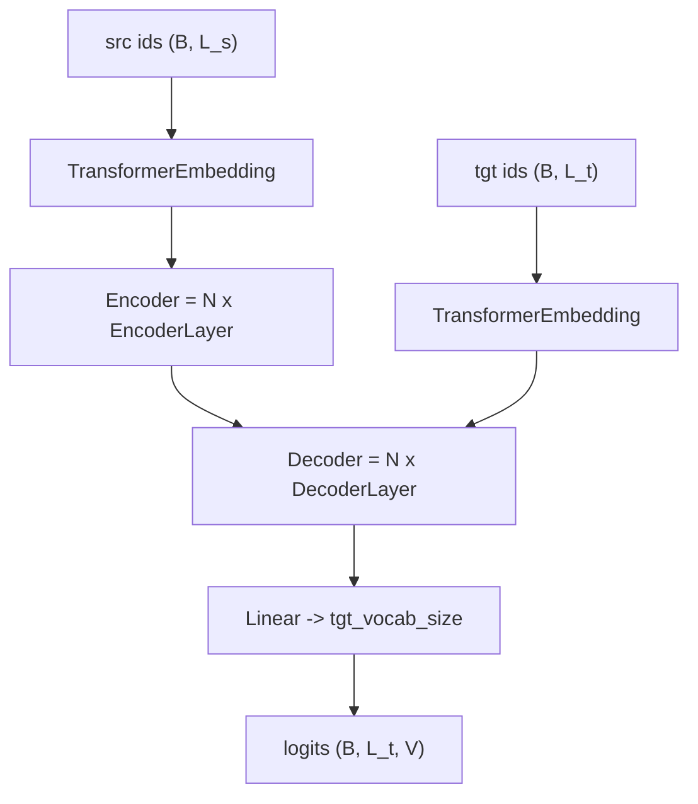
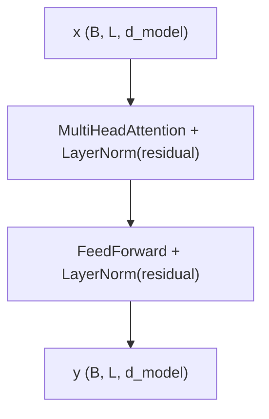
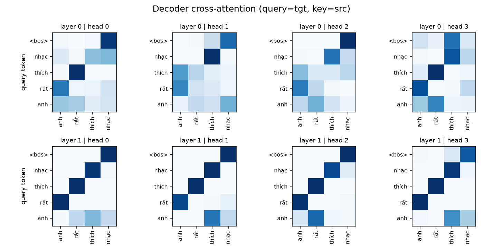
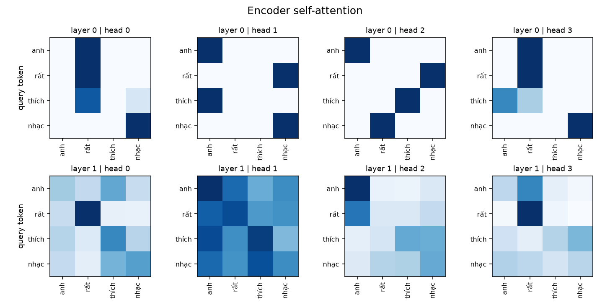

# Transformer from Scratch (PyTorch)

Cài đặt **Transformer encoder–decoder từ đầu** bằng PyTorch thuần — không dùng `torch.nn.Transformer`,
không dùng HuggingFace. Mỗi thành phần (attention, multi-head, feed-forward, positional encoding)
đều viết tay để đọc và hiểu được từng dòng.

Kèm theo một demo nhỏ: train model đảo ngược thứ tự từ trong câu tiếng Việt rồi
**trực quan hóa attention weight matrix** của mọi layer / mọi head.

---

## Bắt đầu từ đâu?

Nếu bạn mới học, đọc theo đúng thứ tự này:

1. `mini_demo.py` — ví dụ nhỏ nhất: **chữ → số → vector** (10 dòng, chạy được ngay)
2. `model/Modules.py` — attention cơ bản
3. `model/SubLayer.py` — multi-head attention + feed-forward
4. `model/Layers.py` — ghép thành 1 lớp encoder / decoder
5. `model/Embedding.py` — token embedding + positional encoding
6. `model/Model.py` — ghép tất cả thành `Encoder`, `Decoder`, `Transformer`
7. `model/Visualize.py` — train thử và vẽ attention

---

## Cấu trúc thư mục

```
TransformerFromScratch/
├── mini_demo.py            # ví dụ nhỏ nhất: chữ → số → vector
├── README.md
└── model/
    ├── Modules.py          # ScaledDotProductAttention
    ├── SubLayer.py         # MultiHeadAttention, FeedForward
    ├── Layers.py           # EncoderLayer, DecoderLayer
    ├── Embedding.py        # PositionalEncoding, TransformerEmbedding
    ├── Model.py            # Encoder, Decoder, Transformer
    ├── Visualize.py        # train thử + vẽ attention
    └── attention_*.png     # ảnh do Visualize.py sinh ra
```

---

## Kiến trúc



Chi tiết bên trong 1 layer:



Decoder có 2 attention: **self-attention** (có causal mask, không nhìn được tương lai)
rồi **cross-attention** (query từ decoder, key/value từ encoder output).

---

## Các file và thành phần

| File | Class | Vai trò |
|---|---|---|
| `Modules.py` | `ScaledDotProductAttention` | `softmax(QKᵀ / √d_k) V`, hỗ trợ causal mask + mask padding |
| `SubLayer.py` | `MultiHeadAttention` | chiếu `W_q, W_k, W_v, W_o`, chia head, dropout, `LayerNorm(X + residual)` |
| `SubLayer.py` | `FeedForward` | `Linear → ReLU → Linear`, dropout, `LayerNorm(X + residual)` |
| `Layers.py` | `EncoderLayer` | self-attention (non-causal) → feed-forward |
| `Layers.py` | `DecoderLayer` | self-attention (causal) → cross-attention → feed-forward |
| `Embedding.py` | `TransformerEmbedding` | `nn.Embedding(vocab, d_model) × √d_model` + positional encoding + dropout |
| `Embedding.py` | `PositionalEncoding` | sinusoidal cố định (không có tham số, lưu bằng `register_buffer`) |
| `Model.py` | `Encoder` / `Decoder` | xếp `num_stacks` lớp bằng `nn.ModuleList` |
| `Model.py` | `Transformer` | embeddings → encoder → decoder → projection, tự sinh pad mask, weight tying |
| `Visualize.py` | — | train toy + vẽ heatmap attention ra 3 file PNG |

### Quy ước shape

| Tensor | Shape |
|---|---|
| `src_input`, `tgt_input` | `(batch, seq_len)` — `int64` |
| embedding output | `(batch, seq_len, d_model)` |
| attention scores / weights | `(batch, heads, len_q, len_kv)` |
| `Transformer` output (logits) | `(batch, len_tgt, tgt_vocab_size)` |

### Quy ước mask (quan trọng)

- `mask` truyền vào attention là tensor **bool**, **`True` = token thật (giữ), `False` = pad (bị chặn → `-inf`)**.
- Padding mask có shape `(batch, 1, 1, seq_len)` — sinh tự động từ `pad_id` qua `Transformer.make_pad_mask()`.
- Causal mask (tam giác trên) **không cần truyền vào** — `DecoderLayer` tự bật `is_causal=True` cho self-attention.

---

## Chạy thử

Yêu cầu: Python 3.14 + `torch` + `matplotlib` (đã có trong `LLM/.venv`).

```sh
cd TransformerFromScratch/model
../../.venv/bin/python Visualize.py
```

```sh
../.venv/bin/python mini_demo.py          # chạy từ TransformerFromScratch/
```

### Tuỳ chọn của `Visualize.py`

| Cờ | Mặc định | Ý nghĩa |
|---|---|---|
| `--steps` | `2500` | số bước train |
| `--lr` | `1e-3` | learning rate |
| `--task` | `reverse` | `reverse` = đảo thứ tự từ, `copy` = giữ nguyên |
| `--demo` | `"anh rất thích nhạc"` | câu đem đi visualize |
| `--holdout` | `15` | số câu giữ riêng để kiểm tra tổng quát hóa |
| `--seed` | `0` | seed |

Câu `--demo` **luôn được giữ riêng khỏi tập train**, nên kết quả visualize là trung thực
(model chưa từng thấy câu đó).

### Kết quả tham chiếu

Corpus 540 câu tiếng Việt (vocab 22 token), model 2 layer / `d_model=64` / 4 head / ~169k tham số:

```
corpus: 540 cau | train: 525 | giu rieng: 15 | vocab: 22 tu
params: 168,726
step 2500 | loss 0.0001
test  : 15/15 cau chua tung thay duoc doan dung
demo  : src = anh rất thích nhạc
        model doan: nhạc thích rất anh <eos>
```

Thời gian: ~43 giây trên CPU (MacBook). Kết quả dùng seed mặc định `0`.

---

## Trực quan hóa attention

Cách hoạt động:

1. `ScaledDotProductAttention` lưu lại attention weight của lần forward cuối vào `self.attn_weights`
   (đã `.detach()` để không giữ computation graph).
2. `Transformer.get_attention_weights()` gom tất cả lại thành `{tên_module: (B, H, L_q, L_kv)}`.
3. `Visualize.plot_group()` vẽ: **mỗi hàng = 1 layer, mỗi cột = 1 head**, mỗi ô là heatmap
   `query token × key token`.

Ba file ảnh sinh ra:

| File | Nội dung |
|---|---|
| `attention_encoder.png` | Encoder self-attention — mỗi head học một kiểu chú ý khác nhau |
| `attention_decoder.png` | Decoder self-attention — thấy rõ causal mask (nửa tam giác trên trắng) |
| `attention_cross.png` | Decoder cross-attention — tgt nhìn vào src; với bài toán đảo ngược từ, layer 1 hiện rõ đường chéo đảo |

Cross-attention (câu `anh rất thích nhạc` → `nhạc thích rất anh`): query `nhạc` chú ý vào key `nhạc`,
`thích` → `thích`, `rất` → `rất`, `anh` → `anh`:



Encoder self-attention:



---

## Dùng với dữ liệu của bạn

```python
from Model import Transformer

model = Transformer(
    src_vocab_size=len(src_itos),
    tgt_vocab_size=len(tgt_itos),
    num_stacks=2, d_model=64, d_hid=128,
    num_heads=4, d_k=16, d_v=16,
    src_pad_id=0, tgt_pad_id=0,   # pad mask sẽ tự sinh từ đây
)

logits = model(src_ids, tgt_ids)     # (batch, len_tgt, tgt_vocab_size)
# logits[:, i] = phân phối cho token tiếp theo, sau khi đã biết tgt_ids[:, :i+1]
```

Loss dùng teacher forcing chuẩn:

```python
import torch.nn as nn

loss_fn = nn.CrossEntropyLoss(ignore_index=pad_id)
loss = loss_fn(logits.reshape(-1, logits.size(-1)), tgt_out.reshape(-1))
```

---

## Ghi chú & bài học

1. **Model chỉ giỏi trong phân bố dữ liệu đã học.** Corpus chỉ có câu 3–4 từ, nên câu 5 từ
   (`"em rất thích học toán"`) bị đoán sai — đây là hành vi bình thường, không phải bug.
2. **Mask `True` = giữ.** Nếu thấy output toàn `nan`, kiểm tra mask đang bị đảo hoặc có một query
   bị chặn hết mọi key.
3. `attn_weights` là **softmax trước dropout**, chỉ giữ lần forward cuối cùng.
4. `PositionalEncoding` mặc định `max_len=5000`; câu dài hơn cần tăng `max_len`.
5. Chưa có script lưu/load checkpoint hay sinh văn bản — xem phần dưới.

---

## Việc có thể làm tiếp

- [ ] Greedy / beam search để sinh câu (generation)
- [ ] Lưu & load checkpoint (`torch.save` / `torch.load`)
- [ ] Vẽ heatmap cho ma trận weight của các lớp `Linear` (`W_q`, `W_k`, `W_v`, `W_o`)
- [ ] Warmup learning rate + label smoothing (đúng như paper)
- [ ] Tokenizer thật cho tiếng Việt (word-level hiện tại chỉ là split theo khoảng trắng)
